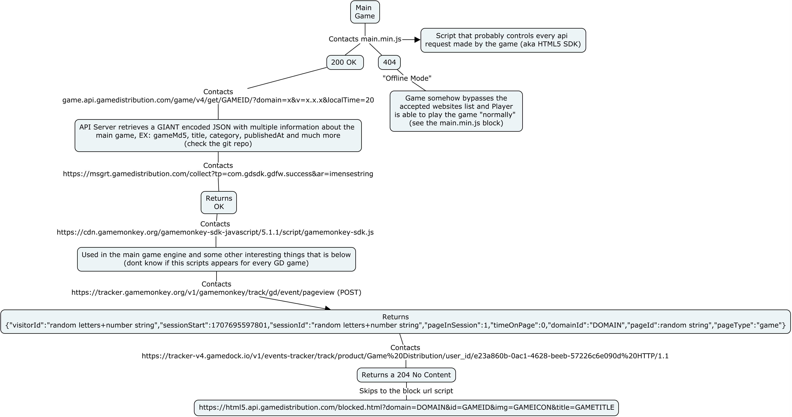

# gamedistribution-apis
list of multiple apis used by html5.gamedistribution and both gamedistribution.com



Game Apis
----
#### game.api.gamedistribution.com
* https://game.api.gamedistribution.com/game/v4/get/a186dc9ac7f548f884db8ff54df6dd9f/?domain=x.x.x&v=1.36.12&localTime=20

```json
{
    "success": true,
    "result": {
        "game": {
            "gameMd5": "a186dc9ac7f548f884db8ff54df6dd9f",
            "title": "Fruit Ninja",
            "status": 9,
            "activeStatus": 0,
            "description": "Welcome to the dojo, ninja. Your objective: become a master of slicing fruit! What better way to do that than play Fruit Ninja, the original hit fruit-slicing mobile game? ? Unsheathe your blade and start the juicy carnage with the three classic game modes that billions of players have come to know and love. ",
            "publishedAt": "2024-01-15T09:14:13.000Z",
            "category": "Casual",
            "tags": [
                {
                    "id": 1240,
                    "title": "fruits"
                },
                {
                    "id": 1949,
                    "title": "ninja"
                },
                {
                    "id": 2570,
                    "title": "slicing"
                },
                {
                    "id": 7460,
                    "title": "singleplayer"
                },
                {
                    "id": 7464,
                    "title": "Kids Friendly"
                },
                {
                    "id": 7465,
                    "title": "No Blood"
                },
                {
                    "id": 7466,
                    "title": "No Cruelty"
                }
            ],
            "assets": [
                {
                    "id": 114848,
                    "name": "a186dc9ac7f548f884db8ff54df6dd9f-1280x550.jpg",
                    "width": 1280,
                    "height": 550
                },
                {
                    "id": 115948,
                    "name": "a186dc9ac7f548f884db8ff54df6dd9f-1280x720.jpg",
                    "width": 1280,
                    "height": 720
                },
                {
                    "id": 116421,
                    "name": "a186dc9ac7f548f884db8ff54df6dd9f-512x384.jpg",
                    "width": 512,
                    "height": 384
                },
                {
                    "id": 116422,
                    "name": "a186dc9ac7f548f884db8ff54df6dd9f-512x512.jpg",
                    "width": 512,
                    "height": 512
                },
                {
                    "id": 116423,
                    "name": "a186dc9ac7f548f884db8ff54df6dd9f-512x340.jpg",
                    "width": 512,
                    "height": 340
                }
            ],
            "preRoll": true,
            "rewardedAds": true,
            "type": 0,
            "externalUrl": null,
            "timeAds": 2,
            "androidBundleId": null,
            "iosBundleId": null,
            "ctry": "BR",
            "dmain": false,
            "crtv": null,
            "dmn": "idkwhattoput.ct8.pl",
            "mobileMode": "Landscape",
            "meta": {
                "ast": {
                    "c": 0.0965
                }
            },
            "bloc_gard": {
                "enabled": true
            },
            "enableAds": {
                "default": false,
                "interstitial": false,
                "rewarded": false
            },
            "push_cuda": {
                "enabled": true
            },
            "loader": {
                "enabled": true,
                "sdk_version": "1.15.2"
            },
            "dads": {
                "enabled": true,
                "left": {
                    "enabled": false,
                    "script": {
                        "src": "https://pm.gamedistribution.com/@bygd/gd-tag-js/0.5.2/dist/default/iife/index.js",
                        "data-slot-id": "pluto-splash-slot-left",
                        "data-flow": "hl"
                    }
                }
            },
            "pads": [
                {
                    "vmap": {
                        "vast_1": {
                            "url": "https://tag.winister.app/v1/32L?referrer={{PAGE_URL}}"
                        },
                        "enabled": true
                    },
                    "weight": 2
                },
                {
                    "vmap": {
                        "vast_2": {
                            "url": "https://tag.winister.app/v1/OLX?referrer={{PAGE_URL}}"
                        },
                        "enabled": true
                    },
                    "weight": 3
                }
            ],
            "mads": [
                {
                    "vmap": {
                        "vast_1": {
                            "url": "https://tag.winister.app/v1/QDN?referrer={{PAGE_URL}}"
                        },
                        "enabled": true
                    },
                    "weight": 2
                },
                {
                    "vmap": {
                        "vast_2": {
                            "url": "https://tag.winister.app/v1/GN0?referrer={{PAGE_URL}}"
                        },
                        "enabled": true
                    },
                    "weight": 3
                }
            ],
            "rads": [
                {
                    "vmap": {
                        "vast_1": {
                            "url": "https://tag.winister.app/v1/0X02?referrer={{PAGE_URL}}"
                        },
                        "enabled": true
                    },
                    "weight": 2
                },
                {
                    "vmap": {
                        "vast_2": {
                            "url": "https://tag.winister.app/v1/7DX?referrer={{PAGE_URL}}"
                        },
                        "enabled": true
                    },
                    "weight": 3
                }
            ],
            "sdk": {
                "afg": {
                    "enabled": true
                }
            },
            "diagnostic": {
                "useTopDomains": true,
                "gameDock": {
                    "adViewEvent": true,
                    "heartbeatConfig": [
                        60000,
                        240000,
                        300000,
                        300000,
                        300000,
                        600000
                    ]
                }
            },
            "splash": {
                "template": "pluto",
                "package_version": "1.3.16",
                "package": "gd-sdk-air-dynamic"
            },
            "promo": {
                "puzzle": {
                    "enabled": false
                },
                "rainbow": {
                    "enabled": true,
                    "position": {
                        "rewarded": true,
                        "preroll": false,
                        "midroll": false
                    },
                    "gift": false,
                    "duration": 10
                },
                "videoEnabled": true
            },
            "cmp": {
                "enabled": true,
                "checkDepthOnly": true
            },
            "gft": [
                {
                    "weight": 2,
                    "preroll": {
                        "enabled": false,
                        "durations": [
                            {
                                "after": 1,
                                "wait": 1
                            }
                        ]
                    },
                    "midroll": {
                        "enabled": true,
                        "durations": [
                            {
                                "after": 2,
                                "wait": 1
                            },
                            {
                                "after": 4,
                                "wait": 1
                            },
                            {
                                "after": 5,
                                "wait": 1
                            }
                        ]
                    },
                    "rewarded": {
                        "enabled": true,
                        "durations": [
                            {
                                "after": 2,
                                "wait": 1
                            },
                            {
                                "after": 4,
                                "wait": 1
                            },
                            {
                                "after": 5,
                                "wait": 1
                            }
                        ]
                    }
                }
            ],
            "sgpid": {
                "id": 99999
            },
            "sdkfw": {
                "enabled": true,
                "handshake": true,
                "sgForward": true
            },
            "sgpr": {
                "enabled": true
            },
            "lp": {
                "load": false
            },
            "dbglg": {
                "enabled": true,
                "topics": [
                    "hl.gameplay",
                    "hl.gameload",
                    "hl.gameplay.error",
                    "hl.gameload.error"
                ]
            },
            "__t4r": [
                {
                    "weight": 7,
                    "preroll": {
                        "enabled": true,
                        "min": 6234,
                        "max": 5432,
                        "viper": 0.7
                    },
                    "midroll": {
                        "enabled": true,
                        "min": 6234,
                        "max": 5432,
                        "viper": 0.7
                    },
                    "rewarded": {
                        "enabled": true,
                        "min": 6234,
                        "max": 5432,
                        "viper": 0.7
                    },
                    "meta": {
                        "ast": {
                            "c": 0.22
                        },
                        "sit": {
                            "c": 0.22
                        }
                    }
                },
                {
                    "weight": 3,
                    "preroll": {
                        "enabled": false
                    },
                    "midroll": {
                        "enabled": false
                    },
                    "rewarded": {
                        "enabled": false
                    }
                }
            ],
            "dp": {
                "preroll": {
                    "enabled": true
                },
                "midroll": {
                    "enabled": true
                },
                "rewarded": {
                    "enabled": true
                }
            },
            "adflw": {
                "adapters": {
                    "default": [
                        "ima",
                        "ima",
                        "adsense",
                        "ima",
                        "adsense",
                        "ima"
                    ],
                    "preroll": [
                        "ima",
                        "ima",
                        "adsense"
                    ],
                    "midroll": [
                        "ima",
                        "ima",
                        "adsense"
                    ],
                    "rewarded": [
                        "ima",
                        "ima",
                        "adsense"
                    ]
                }
            },
            "aws_tst": {
                "enabled": false,
                "ep": {
                    "api": false,
                    "atm": false,
                    "msgrt": false,
                    "loader": false
                }
            },
            "afgszf": {
                "enabled": true,
                "rHeight": "115vh",
                "rScrolls": true
            },
            "fllc": {
                "enabled": false
            },
            "lotm": {
                "enabled": false
            },
            "t4rc": [
                {
                    "weight": 1,
                    "bidder_inc": [
                        "adx"
                    ],
                    "bidder_exc": [
                        "improvedigital",
                        "pubmatic"
                    ]
                }
            ],
            "midroll_plus": {
                "enabled": false
            },
            "gmky": [
                {
                    "weight": 5,
                    "url": "https://cdn.gamemonkey.org/gamemonkey-sdk-javascript/5.1.1/script/gamemonkey-sdk.js"
                }
            ],
            "dtu": {
                "enabled": true,
                "behavior": "to-loader"
            },
            "advlm": {
                "mode": "auto"
            },
            "ctry_vst": 1393607
        }
    }
}
```
